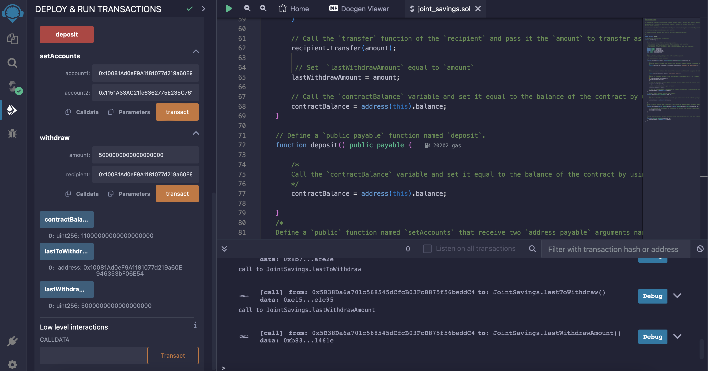

# "Joint Savings Account"

## Deployment
Deploy your smart contract, and then confirm that it successfully deployed.

## setAccount
Use the setAccounts function to define the authorized Ethereum address that will be able to withdraw funds from your contract.
accountOne:
0x10081Ad0eF9A1181077d219a60E946353bF06E54
accountTwo: 0x1151A33AC21fe6362775E235C761926185ABD2A6

## deposit
Deposit functionality of your smart contract by sending the following amounts of ether. After each transaction, use the contractBalance function to verify that the funds were added to your contract:
Transaction 1: Send 1 ether as wei.
Transaction 2: Send 10 ether as wei.
Transaction 3: Send 5 ether.

## withdraw
Withdrawing 5 ether into accountOne and 10 ether into accountTwo. After each transaction, use the contractBalance function to verify that the funds were withdrawn from your contract. Also, use the lastToWithdraw and lastWithdrawAmount functions to verify that the address and amount were correct.

